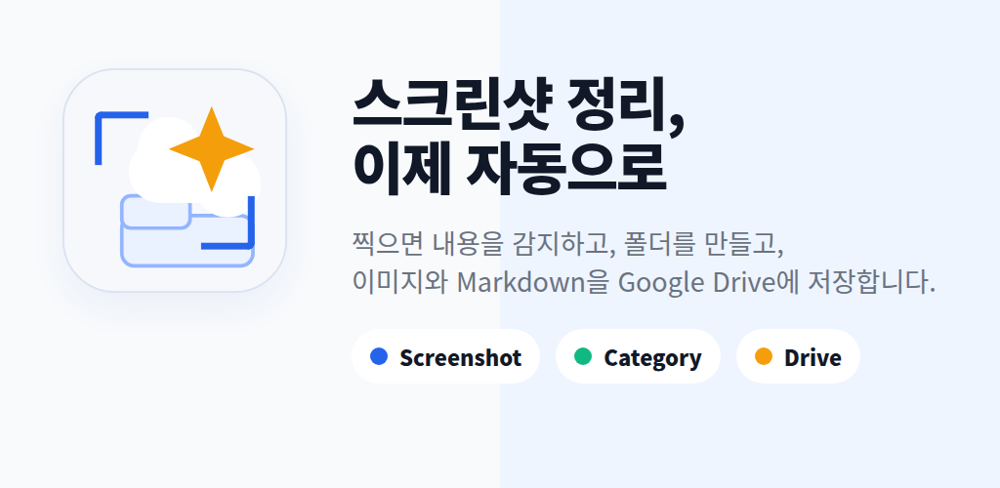
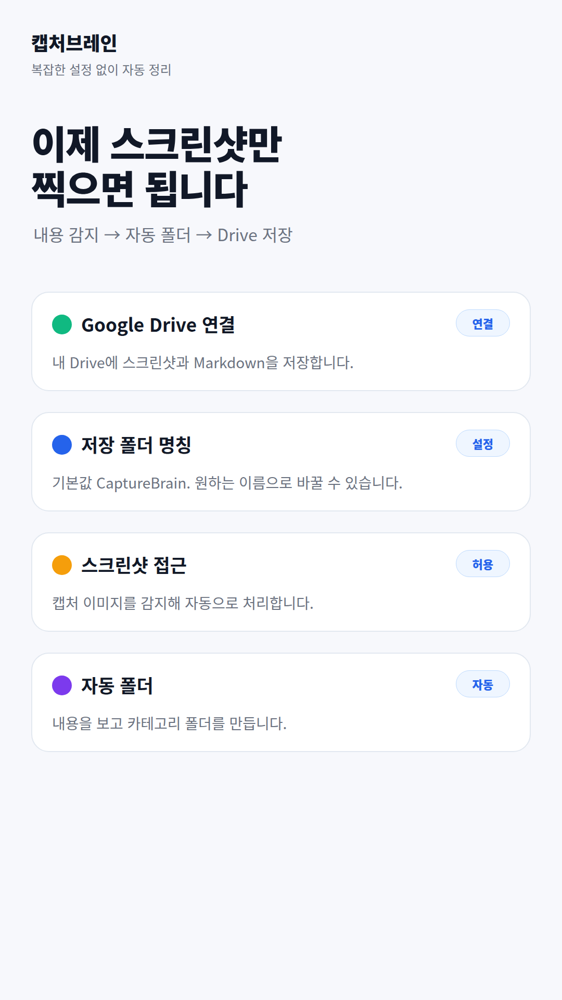
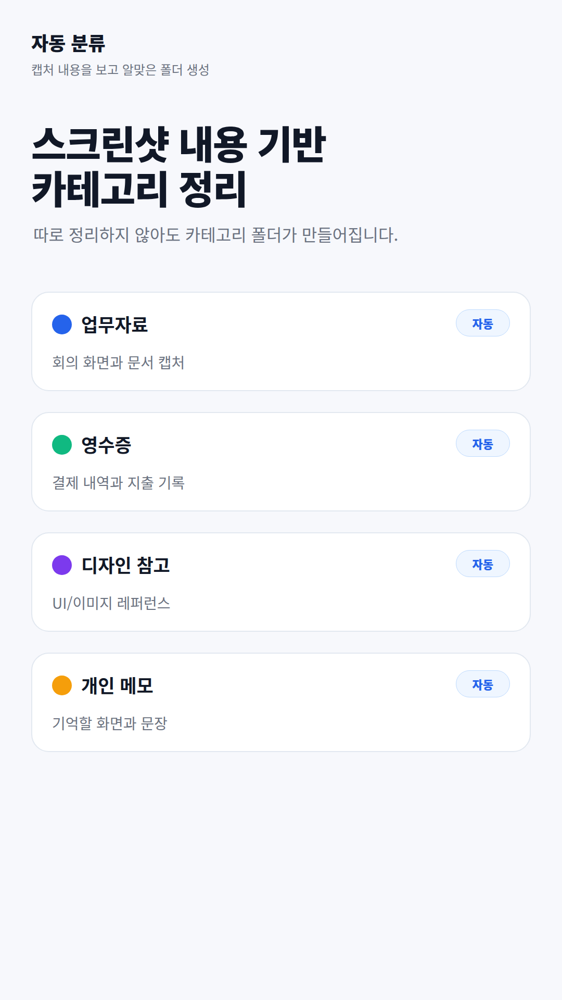
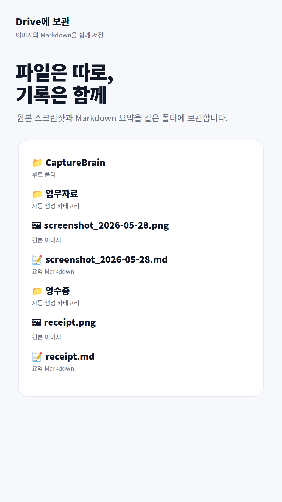
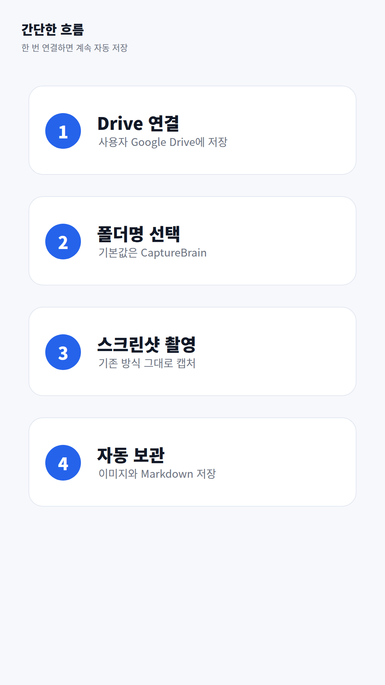

<div align="center">

# 🧠 캡처브레인

### 스크린샷, 이제 자동으로 정리해요

[](https://github.com/DeclanJeon/CaptureBrain/actions/workflows/ci.yml)
[](https://github.com/DeclanJeon/CaptureBrain/actions/workflows/release.yml)
[](https://github.com/DeclanJeon/CaptureBrain/tags)
[](LICENSE)

스크린샷을 찍으면 AI가 내용을 분석해서 카테고리별로 정리하고,  
원본 이미지와 Markdown 노트를 내 Google Drive에 자동 저장합니다.



</div>

---

## ✨ 핵심 기능

| 기능 | 설명 |
|------|------|
| 🔍 **자동 감지** | 새 스크린샷을 실시간으로 감지 |
| 🧠 **AI 분류** | OCR + LLM으로 내용 분석 후 카테고리 자동 선택 |
| ☁️ **Google Drive 저장** | 원본 PNG + Markdown 노트를 Drive에 자동 업로드 |
| 🔒 **민감정보 보호** | 민감한 스크린샷 감지 시 사용자 확인 후 처리 |
| 📂 **스마트 폴더** | `CaptureBrain/카테고리/서브카테고리/날짜/` 구조로 자동 정리 |

## 📱 화면

<table>
<tr>
<td></td>
<td></td>
<td></td>
<td></td>
</tr>
<tr>
<td align="center">홈</td>
<td align="center">자동 분류</td>
<td align="center">Drive 구조</td>
<td align="center">간단한 플로우</td>
</tr>
</table>

## 🏗️ 기술 스택

- **Language**: Kotlin
- **UI**: Jetpack Compose + Material 3
- **Architecture**: MVVM + Repository Pattern
- **Database**: Room (SQLite)
- **Background**: WorkManager + ContentObserver
- **OCR**: Google ML Kit (한국어 + 영어 + 일본어)
- **Storage**: Google Drive API (`drive.file` scope only)
- **Auth**: Google Sign-In + OAuth2
- **DI**: Manual DI (Hilt-free, lightweight)
- **Min SDK**: 26 (Android 8.0) · **Target SDK**: 35

## 📂 프로젝트 구조

```
app/src/main/java/com/ponslink/capturebrain/
├── core/           # ScreenshotContentObserver, background detection
├── data/           # Room DB, DAO, entities
├── drive/          # Google Drive upload, account management
├── settings/       # DataStore preferences
├── ui/             # Compose UI, theme, models
├── worker/         # WorkManager processing pipeline
└── MainActivity.kt # Entry point
```

## 🚀 시작하기

### 1. 클론 & 빌드

```bash
git clone https://github.com/DeclanJeon/CaptureBrain.git
cd CaptureBrain
./gradlew assembleDebug
```

### 2. Google OAuth 설정

1. [Google Cloud Console](https://console.cloud.google.com/)에서 프로젝트 생성
2. OAuth 2.0 Client ID (Android) 생성 후 SHA-1 지문 등록
3. Drive API 활성화

### 3. 릴리즈 빌드

```bash
# 키스토어 생성 (최초 1회)
keytool -genkey -v -keystore upload.keystore \
  -alias capturebrain -keyalg RSA -keysize 2048 -validity 10000

# 환경변수 설정
export CAPTUREBRAIN_UPLOAD_STORE_FILE=/path/to/upload.keystore
export CAPTUREBRAIN_UPLOAD_STORE_PASSWORD=****
export CAPTUREBRAIN_UPLOAD_KEY_ALIAS=capturebrain
export CAPTUREBRAIN_UPLOAD_KEY_PASSWORD=****

# AAB 빌드
./gradlew bundleRelease
```

> 서명 정보는 코드에 하드코딩되지 않습니다. 환경변수로만 관리됩니다.

## 🔄 CI/CD

| 워크플로우 | 트리거 | 동작 |
|-----------|--------|------|
| **CI** | Push / PR to `main` | Lint + Unit Test + Debug Build |
| **Release** | Tag `v*.*.*` | Version auto-bump → AAB Build → GitHub Release |

버전 번호는 `version.properties` 파일에서 관리되며,  
`main` 브랜치에 푸시될 때마다 **patch 버전이 자동 증가**합니다.

## 🔒 보안

- Google Drive 접근에 `drive.file` 스코프만 사용 (앱이 만든 파일만 접근)
- 키스토어/비밀번호 환경변수로만 관리 (저장소에 포함 안 됨)
- 민감정보 자동 감지 → 사용자 확인 후 처리
- 외부 서버 업로드 없음 (모든 파일은 사용자의 Google Drive에만 저장)

## 📄 라이선스

This project is licensed under the MIT License - see the [LICENSE](LICENSE) file for details.

---

<div align="center">

Made with ☕ by [Pons](https://github.com/DeclanJeon)

</div>
